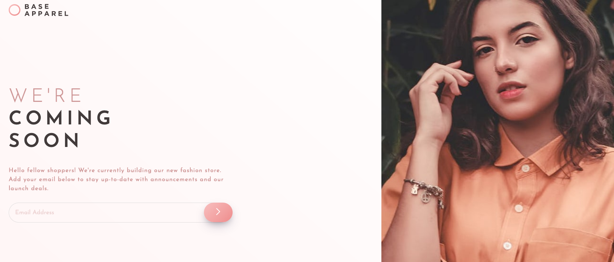

# Frontend Mentor - Base Apparel coming soon page

This is a solution to the [Base Apparel coming soon page challenge on Frontend Mentor](https://www.frontendmentor.io/challenges/base-apparel-coming-soon-page-5d46b47f8db8a7063f9331a0).

## Table of contents

- [Overview](#overview)
  - [The challenge](#the-challenge)
  - [Screenshot](#screenshot)
  - [Links](#links)
- [My process](#my-process)
  - [Built with](#built-with)
  - [What I learned](#what-i-learned)

## Overview

### The challenge

Users should be able to:

- View the optimal layout for the site depending on their device's screen size
- See hover states for all interactive elements on the page
- Receive an error message when the `form` is submitted if:
  - The `input` field is empty
  - The email address is not formatted correctly

### Screenshot

### Links

- [Repository URL](https://github.com/humbruno/base-apparel)
- [Live Site URL](https://humbruno.github.io/base-apparel/)

## My process

### Built with

- Semantic HTML5 markup
- SCSS
- Gulp
- Flexbox
- Mobile-first workflow
- JavaScript

### What I learned

This project highlighted a few gaps in my knowledge when working with images and switching before different ones depending on the viewport.

Nevertheless, it was very helpful to explore various approches to switching between them and find out which one works best for each project.

The JavaScript email validation, albeit simple, was great practice into doing research about topics I may not be completely familar with, which I believe to be an essential skill to any developer.
